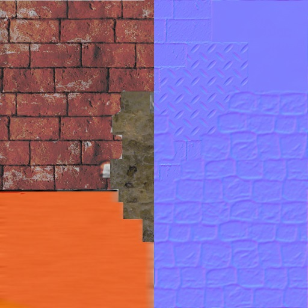
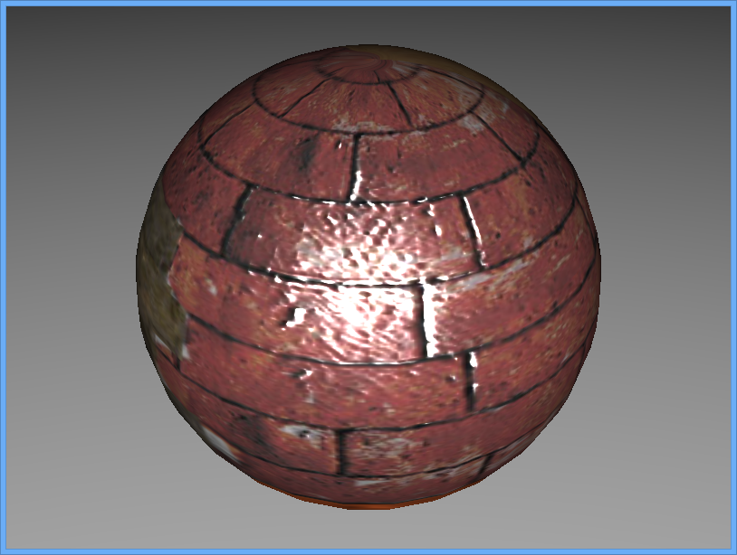

This tutorial will introduce normal mapping and how to use it in your scene.

What is a normal map
--------------------

Normal maps are images that store normal information directly in the RGB value of a pixel. It allows Minko to compute per pixel normal instead of per triangle normal inside the fragment shader. The first noticeable effect is it adds details on your 3D object that will look like there is much more triangles than reality.

If you would like more information about normal mapping and normal map: <http://en.wikipedia.org/wiki/Normal_mapping>.

Prerequisites
-------------

To fully understand the rest of the tutorial, you need to know how to setup a scene with a phong material, and how to load textures:

-   [Working with the PhongMaterial](Working_with_the_PhongMaterial.md)
-   [Loading and using textures](Loading_and_using_textures.md)

Step 0: Setup a scene
---------------------

The setup will be the same that the one at the end of the [Working with the PhongMaterial](Working_with_the_PhongMaterial.md) tutorial:


```cpp
 #include "minko/Minko.hpp" #include "minko/MinkoPNG.hpp" #include "minko/MinkoSDL.hpp"

using namespace minko; using namespace minko::component; using namespace minko::math;

int main(int argc, char** argv) {

autocanvas=Canvas::create("",800,600);
autosceneManager=SceneManager::create(canvas->context());
//addthepngparsertoloadtextures
//addthePhongeffect
sceneManager->assets()
->registerParser<[file::PNGParser>](file::PNGParser>)("png")
->queue("texture/diffuseMap.png")
->queue("effect/Phong.effect");
auto_=sceneManager->assets()->complete()->connect([=](file::AssetLibrary::Ptrassets)
{
autoroot=scene::Node::create("root")
->addComponent(sceneManager);
autophongMaterial=material::PhongMaterial::create();
phongMaterial->diffuseMap(assets->texture("texture/diffuseMap.png"));
phongMaterial->shininess(2.f);
phongMaterial->specularColor(math::Vector4::create(0.4f,0.8f,1.f,1.f));
automesh=scene::Node::create("mesh")
->addComponent(Transform::create(Matrix4x4::create()->prependScale(1.1)))
->addComponent(Surface::create(
geometry::SphereGeometry::create(sceneManager->assets()->context()),
phongMaterial,
assets->effect("effect/Phong.effect")
));
autocamera=scene::Node::create("camera")
->addComponent(Renderer::create(0x00000000))
->addComponent(Transform::create(Matrix4x4::create()->lookAt(Vector3::create(),Vector3::create(0.0f,1.f,1.3f))
))
->addComponent(PerspectiveCamera::create(800.f/600.f,(float)PI*0.25f,.1f,1000.f));
autoambientLight=scene::Node::create("ambientLight")
->addComponent(AmbientLight::create(0.25f));
ambientLight->component<AmbientLight>()->color(Vector4::create(1.0f,1.0f,1.0f,1.0f));
root->addChild(ambientLight);

autospotLight=scene::Node::create("SpotLight")
->addComponent(SpotLight::create(0.6f,0.78f,20.f))
->addComponent(Transform::create(Matrix4x4::create()->lookAt(Vector3::zero(),Vector3::create(4.f,6.f,2.5f))));
spotLight->component<SpotLight>()->diffuse(0.4f);

root->addChild(camera);
root->addChild(mesh);
root->addChild(spotLight);
autoenterFrame=canvas->enterFrame()->connect([&](Canvas::Ptrcanvas,floatt,floatdt)
{
sceneManager->nextFrame(t,dt);
});
canvas->run();
});
sceneManager->assets()->load();
return0;

} 
```


Step 1: Setting a normal map
----------------------------

normalMap are images just like diffuseMap, so their loading workflow are identical


```cpp
 sceneManager->assets()->queue("texture/normalmap.png"); 
```


Then, the normal texture will be available in the [file::AssetsLibrary](file::AssetsLibrary) once all files are loaded.

The PhongMaterial defines one method to set a normalMap:

-   PhongMaterial::normalMap(AbstractTexture::Ptr texture)

There is two types of texture : Texture2D and CubeTexture (listed in the TextureType enum). Currently only 2D textures normalMap are supported.

| scope="col" widt"100px"| DiffuseMap / NormalMap            | Right                                            | Left                                             | Front                                            |
|------------------------------------------------------------|--------------------------------------------------|--------------------------------------------------|--------------------------------------------------|
|               |  |  |  |
|               |  |  |  |
|  |  |  |  |
||

Final Code
----------


```cpp
 #include "minko/Minko.hpp" #include "minko/MinkoPNG.hpp" #include "minko/MinkoSDL.hpp"

using namespace minko; using namespace minko::component; using namespace minko::math;

int main(int argc, char** argv) {

autocanvas=Canvas::create("MinkoTutorial-Workingwithnormalmaps",800,600);
autosceneManager=SceneManager::create(canvas->context());
//addthepngparsertoloadtextures
//addthePhongeffect
sceneManager->assets()
->registerParser<[file::PNGParser>](file::PNGParser>)("png")
->queue("texture/diffuseMap.png")
->queue("texture/normalMap.png")
->queue("effect/Phong.effect");
auto_=sceneManager->assets()->complete()->connect([=](file::AssetLibrary::Ptrassets)
{
autoroot=scene::Node::create("root")
->addComponent(sceneManager);
autophongMaterial=material::PhongMaterial::create();
phongMaterial->diffuseColor(0xFFFFFFFF);
phongMaterial->diffuseMap(assets->texture("texture/diffuseMap.png"));
phongMaterial->normalMap(assets->texture("texture/normalMap.png"));
automesh=scene::Node::create("mesh")
->addComponent(Transform::create(Matrix4x4::create()->prependScale(1.1)))
->addComponent(Surface::create(
geometry::SphereGeometry::create(sceneManager->assets()->context()),
phongMaterial,
assets->effect("effect/Phong.effect")
));
autocamera=scene::Node::create("camera")
->addComponent(Renderer::create(0x00000000))
->addComponent(Transform::create(Matrix4x4::create()->lookAt(Vector3::create(),Vector3::create(0.0f,1.f,1.3f))
))
->addComponent(PerspectiveCamera::create(800.f/600.f,(float)PI*0.25f,.1f,1000.f));
autoambientLight=scene::Node::create("ambientLight")
->addComponent(AmbientLight::create(0.25f));
ambientLight->component<AmbientLight>()->color(Vector4::create(1.0f,1.0f,1.0f,1.0f));
root->addChild(ambientLight);

autospotLight=scene::Node::create("SpotLight")
->addComponent(SpotLight::create(0.6f,0.78f,20.f))
->addComponent(Transform::create(Matrix4x4::create()->lookAt(Vector3::zero(),Vector3::create(4.f,6.f,2.5f))));
spotLight->component<SpotLight>()->diffuse(0.4f);
root->addChild(camera);
root->addChild(mesh);
root->addChild(spotLight);
autoenterFrame=canvas->enterFrame()->connect([&](Canvas::Ptrcanvas,floatt,floatdt)
{
sceneManager->nextFrame(t,dt);
});
canvas->run();
});
sceneManager->assets()->load();
return0;

} 
```


Where to go from here
---------------------

normalMap can me mixed with specularMap ([Working with specular maps](Working_with_specular_maps_.md)) and/or environmentMap ([Working with environment maps ](Working_with_environment_maps_.md)) to produce great effect on your 3D models: [ PhongMaterial reference full example](PhongMaterial_reference.md).

