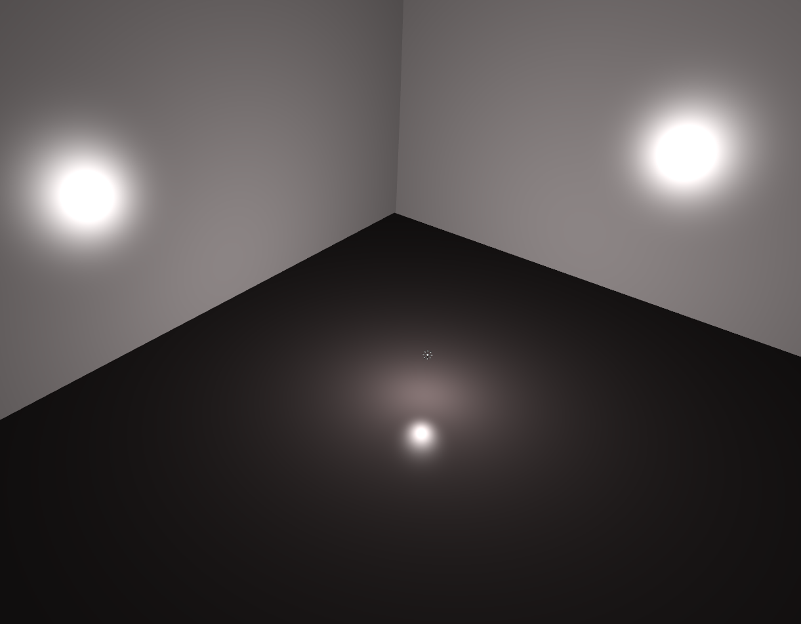
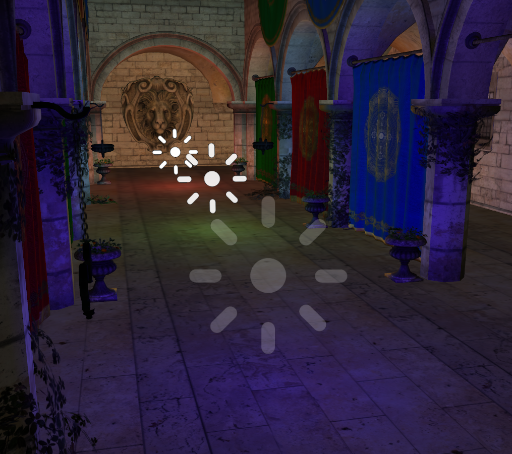

A point light casts illumination in every direction from a single point in 3D space. Point lights are useful for simulating any omnidirectional light source: Light-bulbs, candles, Christmas tree lights, gun-fire etc.



As the point light is emitting in every directions, his reflection can be multiple places in the environment.



In this more complex setup, you can see how multiple point lights render on a complex environment.

Step 1: Instantiate a point light
---------------------------------

The first very first thing you need to do is to include the following header to your .cpp file.


```cpp
 #include <PointLight.hpp> 
```


To create a new [PointLight](http://doc.minko.io/reference/v3/classminko_1_1component_1_1_point_light.html) object, we simply use the PointLight::create(float attenuationDistance=-1.0f) static method. The argument passed to the method is optional and defines the attenuation of the light emitted proportionally to the distance, the default value is -1.

Step 2: Adding a point light to the scene
-----------------------------------------

To add a point light to a scene, you have to understand that a Scene is a graph composed of one or more Node. Those nodes can contain elements that are called Component.

As a PointLight is a Component you'll have to follow this logic to create and add a light to a scene.


```cpp


//CreatingtheNode
autopointLightNode=scene::Node::create("pointLight");

//AddingtheComponentPointLight
pointLightNode->addComponent(PointLight::create(0.1f));

//AddingtheNodetotherootofthescenegraph
root->addChild(pointLightNode);


```


As you can see in the code above, we first create a node named "pointLight" to which we add an instance of a point light. Of course you can chain those methods to perform actions in one line of code


```cpp


//CreatingtheNode&addingtheComponentPointLight
autopointLightNode=scene::Node::create("pointLight")->addComponent(PointLight::create(0.1f));


```


Step 3: Change point light properties
-------------------------------------

you can directly change way the light appears by modifying it's public parameters, for example :


```cpp


autopointLight=PointLight::create();

pointLight->diffuse(.4f); 
```


Step 4: Remove a point light from the scene
-------------------------------------------

You may sometime need to remove a light from a scene, to do this you simply need to remove the point light from the Node it has been added to before.


```cpp


//Addinganpointlight
autopointLightNode=scene::Node::create("pointLight")->addComponent(PointLight::create(0.1f));

//retrievingthecomponent
autopointLight=pointLightNode->component<PointLight>(0);

//Removethecomponentfromthenode
pointLightNode->removeComponent(pointLight);


```


As you can see above, the first step is to retrieve the light component with previously created and then remove it from the Node

Final code
----------


```cpp
 #include "minko/Minko.hpp" #include "minko/MinkoPNG.hpp" #include "minko/MinkoSDL.hpp"

using namespace minko; using namespace minko::math; using namespace minko::component;

const uint WINDOW\WIDTH = 800; const uint WINDOW\HEIGHT = 600;

int main(int argc, char** argv) {

autocanvas=Canvas::create("MinkoTutorial-Workingwithpointlights",WINDOW_WIDTH,WINDOW_HEIGHT);
autosceneManager=component::SceneManager::create(canvas->context());

//setupassets
sceneManager->assets()->defaultOptions()->generateMipmaps(true);
sceneManager->assets()->registerParser<[file::PNGParser>](file::PNGParser>)("png");
sceneManager->assets()
->queue("effect/Sprite.effect")
->queue("effect/Phong.effect")
->queue("texture/sprite-pointlight.png");

autocomplete=sceneManager->assets()->complete()->connect([&](file::AssetLibrary::Ptrassets)
{
autoroot=scene::Node::create("root")->addComponent(sceneManager);

autocamera=scene::Node::create("camera")
->addComponent(Renderer::create(0x7f7f7fff))
->addComponent(Transform::create(
Matrix4x4::create()->lookAt(Vector3::create(0.f,1.f,0.f),Vector3::create(0.f,1.f,-3.f))
))
->addComponent(PerspectiveCamera::create(
(float)WINDOW_WIDTH/(float)WINDOW_HEIGHT,(float)PI*0.25f,.1f,1000.f)
);
root->addChild(camera);

//createaground
autoground=scene::Node::create("ground")
->addComponent(Surface::create(
geometry::QuadGeometry::create(assets->context()),
material::BasicMaterial::create()->diffuseColor(Vector4::create(0.5f,0.5f,0.5f,1.f)),
assets->effect("effect/Phong.effect")
))
->addComponent(Transform::create(Matrix4x4::create()->appendScale(4.f)->appendRotationX(-(PI/2))));
root->addChild(ground);

//createaleftwall
autoleftWall=scene::Node::create("leftWall")
->addComponent(Surface::create(
geometry::QuadGeometry::create(assets->context()),
material::BasicMaterial::create()->diffuseColor(Vector4::create(0.5f,0.5f,0.5f,1.f)),
assets->effect("effect/Phong.effect")
))
->addComponent(Transform::create(Matrix4x4::create()->appendScale(4.f)->appendRotationY(-(PI/2))->appendTranslation(1.f,1.f,0.f)));
root->addChild(leftWall);

//createarightwall
autorightWall=scene::Node::create("rightWall")
->addComponent(Surface::create(
geometry::QuadGeometry::create(assets->context()),
material::BasicMaterial::create()->diffuseColor(Vector4::create(0.5f,0.5f,0.5f,1.f)),
assets->effect("effect/Phong.effect")
))
->addComponent(Transform::create(Matrix4x4::create()->appendScale(4.f)->appendRotationY((PI/2))->appendTranslation(-1.f,1.f,0.f)));
root->addChild(rightWall);

//createabackwall
autobackWall=scene::Node::create("backWall")
->addComponent(Surface::create(
geometry::QuadGeometry::create(assets->context()),
material::BasicMaterial::create()->diffuseColor(Vector4::create(0.5f,0.5f,0.5f,1.f)),
assets->effect("effect/Phong.effect")
))
->addComponent(Transform::create(Matrix4x4::create()->appendScale(4.f)->appendRotationX(PI)->appendTranslation(0.f,1.f,1.f)));
root->addChild(backWall);

//createthepointlightnode
autopointLightNode=scene::Node::create("pointLight")
->addComponent(Transform::create(Matrix4x4::create()->translation(0,1.f,0)));

//addaspritetohavealightrepresentation
pointLightNode->addComponent(Surface::create(
geometry::QuadGeometry::create(assets->context()),
material::Material::create()
->set("diffuseMap",assets->texture("texture/sprite-pointlight.png"))
->set("diffuseTint",Vector4::create(1.f,1.f,1.f,1.f)),
assets->effect("effect/Sprite.effect")
));

//createthepointlightcomponent
autopointLight=PointLight::create();

//updatethepointlightcomponentattributes
pointLight->diffuse(0.5f);

//addthecomponenttothepointlightnode
pointLightNode->addComponent(pointLight);

//addtheNodetotherootofthescenegraph
root->addChild(pointLightNode);

autoenterFrame=canvas->enterFrame()->connect([&](Canvas::Ptrcanvas,floatt,floatdt)
{
sceneManager->nextFrame(t,dt);
});

canvas->run();
});

sceneManager->assets()->load();

return0;

} 
```


