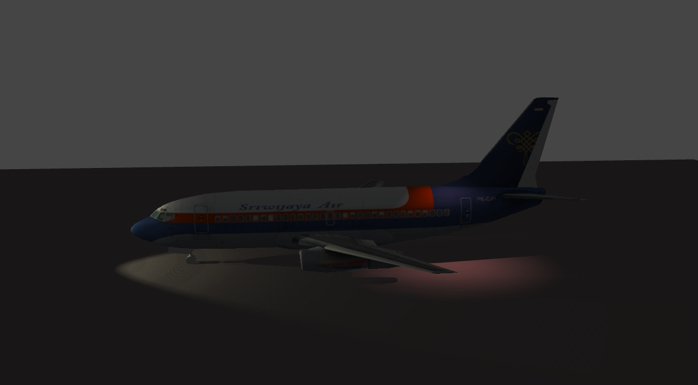

Spot lights are rather similar to their real-world counterparts. A spot light emits a cone shaped light field from a single point in space. Spotlights are often used for three-point studio lighting, and also for simulating any light fixture where there is a distinct visual falloff from light to dark—streetlights, desk lamps, overhead cone lighting, etc.

Let's start with something simple, a red spot light, emitting to the ground. as the widget imply, the light is only spread in one direction.


This setup is a little more complex, it introduces multiple spot lights emitting on a complex object with shadows enabled. As you can see with the yellowish light, the light attenuate with the distance, the closer the object is from the spot light, the stronger the light light will be.



Step 1: Instantiate a spot light
--------------------------------

The first very first thing you need to do is to include the following header to your .cpp file.


```cpp
 #include <SpotLight.hpp> 
```


To create a new [SpotLight](http://doc.minko.io/reference/v3/classminko_1_1component_1_1_spot_light.html) object, we simply use the PointLight::create static method.

The create method needs at least two arguments to be instantiated :

-   float *innerAngleRadians*: defines the inner angle for the cone of light
-   float *outerAngleRadians*: defines the outer angle for the cone of light
-   **(optional)** float *attenuationDistance* : defines the attenuation of the light emitted proportionally to the distance

Step 2: Adding a spot light to the scene
----------------------------------------

To add a point light to a scene, you have to understand that a Scene is a graph composed of one or more Node. Those nodes can contain elements that are called Component.

As a SpotLight is a Component you'll have to follow this logic to create and add a light to a scene.


```cpp


//CreatingtheNode
autospotLightNode=scene::Node::create("spotLight");

//AddingtheComponentSpotLight
spotLightNode->addComponent(SpotLight::create(.15f,.4f));

//AddingtheNodetotherootofthescenegraph
root->addChild(spotLightNode);


```


As you can see in the code above, we first create a node named "spotLight" to which we add an instance of a spot light. Of course you can chain those methods to perform all in one line of code


```cpp


//CreatingtheNode&addingtheComponentSpotLight
autospotLightNode=scene::Node::create("spotLight")->addComponent(SpotLight::create(.15f,.4f));


```


Step 3: Change spot light properties
------------------------------------

you can directly change way the light appears by modifying it's public parameters, for example : 
```cpp


autospotLight=SpotLight::create(.15f,.4f);
spotLight->diffuse(.4f);


```


Step 4: Adjust a spot light
---------------------------

Once the light is created you might want to turn the spot light toward a direction. To do this you need to add a transformation matrix to the Node holding your spot light.


```cpp
 auto spotLight = scene::Node::create("spotLight")

->addComponent(SpotLight::create(.15f,.4f))
->addComponent(Transform::create(Matrix4x4::create()->lookAt(Vector3::zero(),Vector3::create(15.f,20.f,0.f))));


```


Step 5: Remove a spot light from the scene
------------------------------------------

You may sometime need to remove a light from a scene, to do this you simply need to remove the spot light from the Node it has been added to before.


```cpp


//Addinganspotlight
autospotLightNode=scene::Node::create("spotLight")->addComponent(SpotLight::create(.15f,.4f));

//retrievingthecomponent
autospotLight=spotLightNode->component<SpotLight>(0);

//Removethecomponentfromthenode
spotLightNode->removeComponent(spotLight);


```


As you can see above, the first step is to retrieve the light component with previously created and then remove it from the Node

Final code
----------


```cpp
 #include "minko/Minko.hpp" #include "minko/MinkoSDL.hpp"

using namespace minko; using namespace minko::math; using namespace minko::component;

const uint WINDOW\WIDTH = 800; const uint WINDOW\HEIGHT = 600;

int main(int argc, char** argv) {

autocanvas=Canvas::create("MinkoTutorial-Workingwithspotlights",WINDOW_WIDTH,WINDOW_HEIGHT);
autosceneManager=component::SceneManager::create(canvas->context());

//setupassets
sceneManager->assets()->defaultOptions()->generateMipmaps(true);
sceneManager->assets()->queue("effect/Phong.effect");

autocomplete=sceneManager->assets()->complete()->connect([&](file::AssetLibrary::Ptrassets)
{
autoroot=scene::Node::create("root")->addComponent(sceneManager);

autocamera=scene::Node::create("camera")
->addComponent(Renderer::create(0x7f7f7fff))
->addComponent(Transform::create(
Matrix4x4::create()->lookAt(Vector3::zero(),Vector3::create(0.f,3.f,-5.f))
))
->addComponent(PerspectiveCamera::create(
(float)WINDOW_WIDTH/(float)WINDOW_HEIGHT,(float)PI*0.25f,.1f,1000.f)
);
root->addChild(camera);

//createaground
autoground=scene::Node::create("sphere")
->addComponent(Surface::create(
geometry::QuadGeometry::create(assets->context()),
material::BasicMaterial::create()->diffuseColor(Vector4::create(0.f,0.f,0.f,1.f)),
assets->effect("effect/Phong.effect")
))
->addComponent(Transform::create(Matrix4x4::create()->appendScale(3.f)->appendRotationX(-1.57f)));
root->addChild(ground);

//createthespotlightnode
autospotLightNode=scene::Node::create("spotLight");

//changethespotlightposition
spotLightNode->addComponent(Transform::create(Matrix4x4::create()->lookAt(Vector3::zero(),Vector3::create(0.1f,2.f,0.f))));

//createthepointlightcomponent
autospotLight=SpotLight::create(.15f,.4f);

//updatethespotlightcomponentattributes
spotLight->diffuse(0.5f);

//addthecomponenttothespotlightnode
spotLightNode->addComponent(spotLight);

//addthenodetotherootofthescenegraph
root->addChild(spotLightNode);

autoenterFrame=canvas->enterFrame()->connect([&](Canvas::Ptrcanvas,floatt,floatdt)
{
spotLightNode->component<Transform>()->matrix()->appendRotationX(0.002f*dt);

sceneManager->nextFrame(t,dt);
});

canvas->run();
});

sceneManager->assets()->load();

return0;

} 
```


