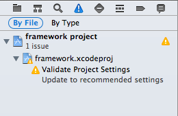
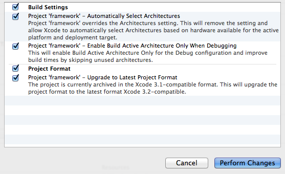

This tutorial will guide through the few steps to compile the Minko SDK **for iOS** using Xcode. Compiling the SDK for iOS is **only available on OS X** at the moment.

We need to install [Xcode](https://developer.apple.com/xcode/) 5. Xcode is available on the Mac App Store for free, which is the easiest way to get it.

Step 1: Get the sources
-----------------------

Make sure you have the source code of Minko on your filesystem. You can get them from our repository: [Installing the Minko SDK sources](Installing the SDK (Git)).

Step 2: Generating the Xcode solution
-------------------------------------

Minko's SDK uses premake5, which is embed in the SDK, for its build system. Premake is a nice solution to have a cross-platform build system that can work with multiple IDEs such as XCode, Visual Studio and even gmake. To work with Minko's SDK, we will have to use premake to generate an Xcode solution.

To do this, open a command line prompt in the root directory of the SDK and run:


```bash
 $ tool/mac/script/solution\xcode.sh 
```


You should have the following result in the console: 

Make sure a minko.xcworkspace solution file has been properly generated. If this operation was successful, you should have a *.xcodeproj project file in each project directory.

Step 3: Updating the project for Xcode 5 (optional)
---------------------------------------------------

The generated solution file may generated outdated options, which is fine since Xcode will update the project automatically.

Just go to the warning tab in Xcode. You should see a warning for each project and plugin linked in the current open project.



Just click on each warning. Xcode will prompt you to update, but before, you can perform a snapshot of the current project settings. Feel free to do so, even it doesn't have any incidence on the project.



Just click "Perform Changes" and Xcode will upgrade the project.

Step 4: Compile the SDK
-----------------------

The Minko SDK is now ready. Just hit **⌘+B** to build the solution.

Step 5: Package (optional)
--------------------------

The SDK is now built, but you might want to share or copy it so you don't have to deal with the sources again. We use a script to produce a distributable SDK. Open a terminal at the SDK root and run:


```bash
 $ tool/mac/script/dist.sh 
```


This should produce an archive in the root of the SDK which contains all the binaries built for your platform.

Step 6: Enjoy!
--------------

Now use your SDK to [Create a new application](Create_a_new_application.md).

