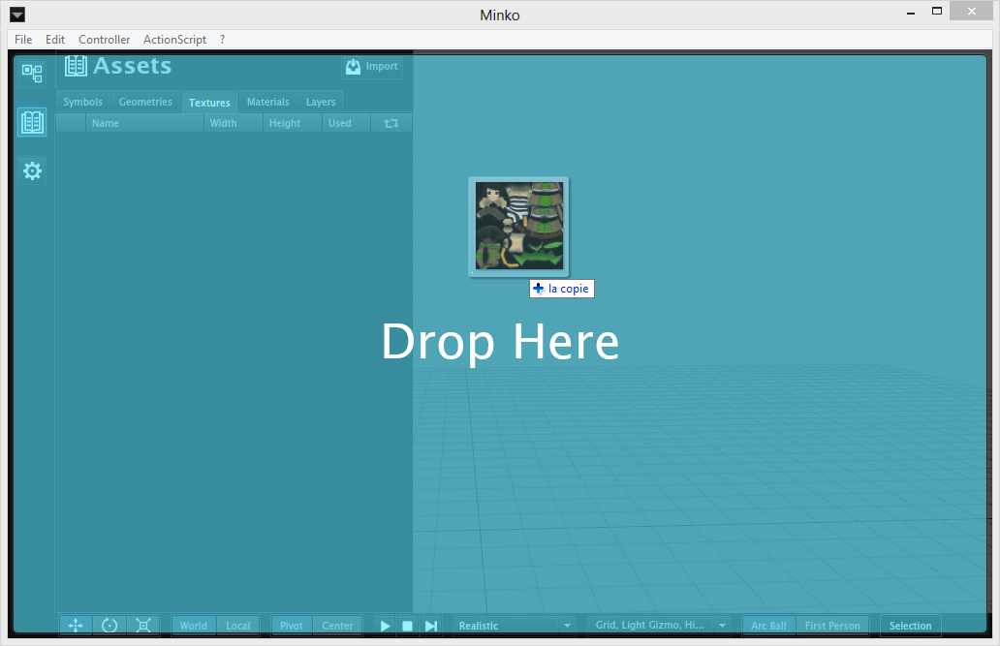
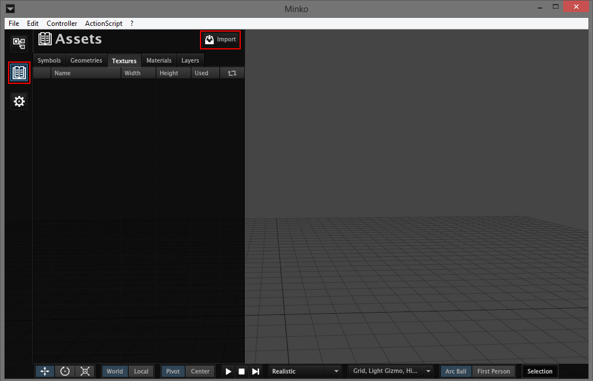
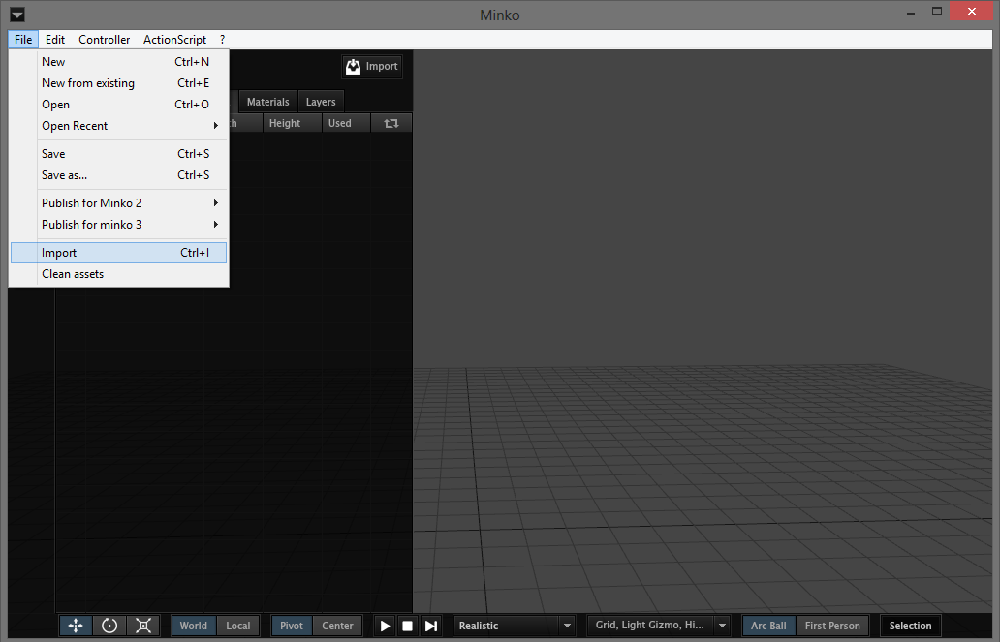
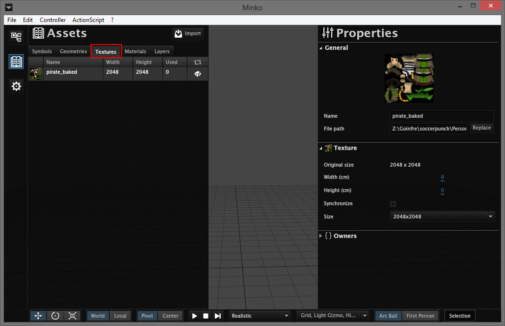
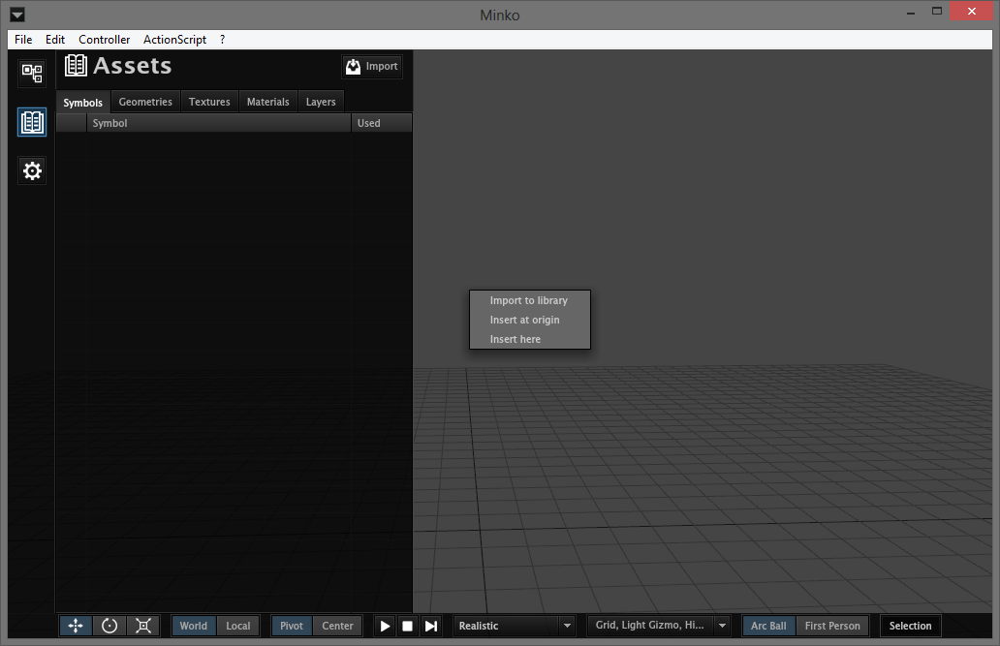
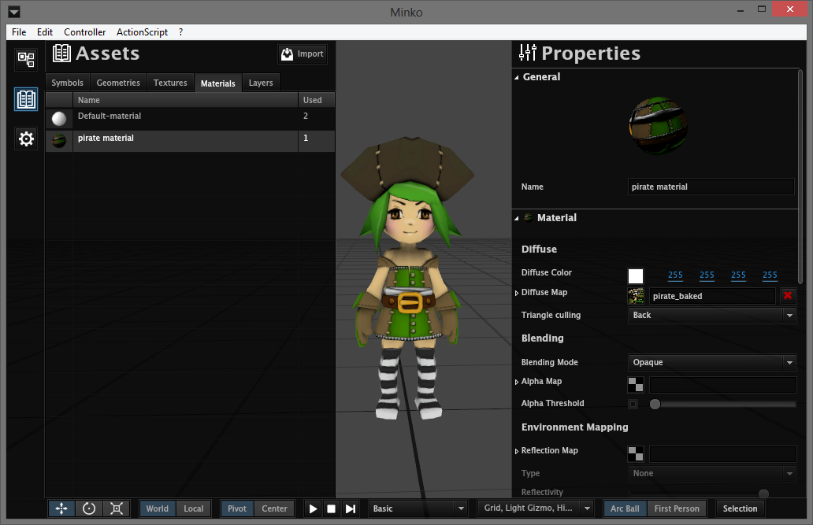

In Minko, you can import textures and 3D models of a large number of formats.

Different ways of importing assets
==================================

#### Drag and drop

The easiest way to import an asset is to drag and drop the file on the software. You can select one of multiple files.

#### Assets panel button

Open the `Assets` panel (second button on the left column) and click on the import button.

#### From the file menu

Click `File-> Import` on the menu bar.

#### Keyboard shortcut

Finally, you can use the shortcut `Ctrl + i` to import assets.

Importing textures
==================

All imported textures go in the `Textures` tab of the `Assets` panel.

#### Supported formats

The following formats are supported :

-   JPEG
-   PNG
-   BMP
-   GIF
-   JPEG 2000
-   TGA
-   TIFF
-   PSD
-   DDS
-   RAW

#### Replacing or synchronizing a texture

When you select a texture, you will have access to some useful options on the `Properties` panel :

-   If you tick the `Synchronize` box, your texture will be automatically updated if the original file has changed.
-   With the `Replace` button, you can replace that texture with another file.

Importing 3D models
===================

#### Import Options

If you drag and drop a 3D model file, you will have 3 import options :

-   `Import to library` will simply import the model to the library
-   `Import at origin` will add a copy of the symbol at the origin of the scene after it has been imported
-   `Import here` will add a copy of the symbol where the mouse is currently

In any case, all 3D models will go in the `Symbols` tab of the `Assets` panel.

#### Supported formats

The following formats are supported :

-   DAE
-   OBJ
-   FBX
-   BLEND
-   3DS
-   ASE

#### Dependencies and materials

Any material will be created and will appear in the `Materials` tab of the `Assets` panel. Any textures used in these materials will be imported if it has been found.

