Selecting a material
====================

There are two ways of editing a material :

-   Through the `Materials` tab of the `Assets` panel, select the material you want to edit.

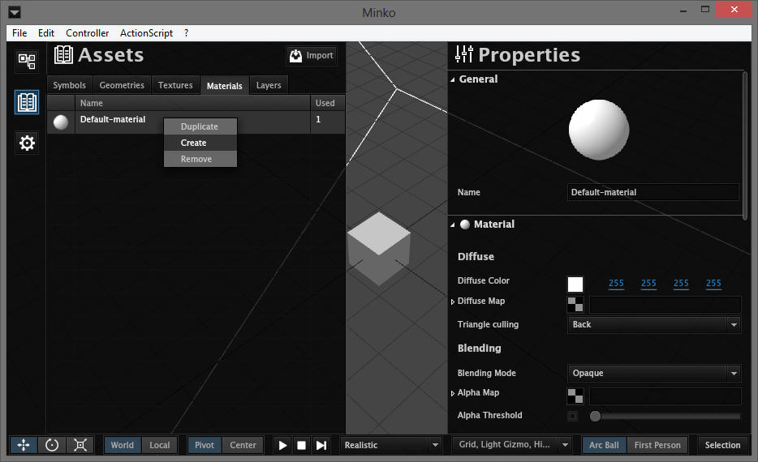

You can also `create`, `duplicate` and `remove` materials with the right click menu of the `materials` list.

-   By selecting a mesh that uses the material you want to edit

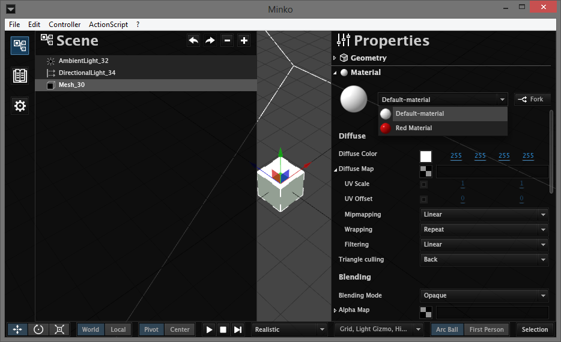

You can also choose the material of a mesh with the drop-down list at the top of the `Material` section of the mesh properties. You can also fork a material with the `fork` button, this will duplicate the current material and set the duplicate as the current material for the selected mesh.

Editing the material
====================

Diffuse
-------

#### Diffuse Color

This will set the color of your material. You can either set the R, G, B and A components (from left to right), or use the color picker. The color picker also allows you to specify the color with HSV components.

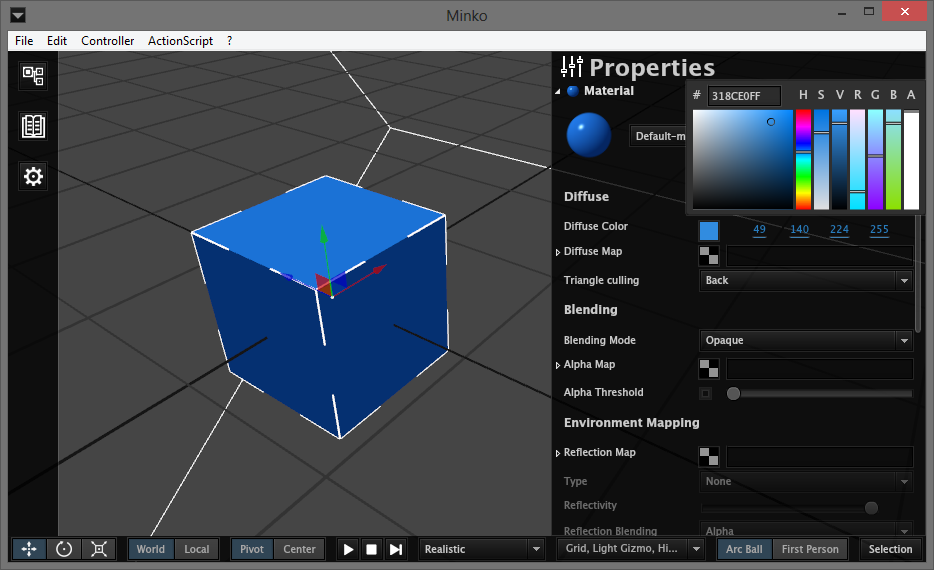

#### Diffuse Map

Drag and drop a texture from the `Assets` panel to use as a diffuse map. If a diffuse map is set, it will override the diffuse color.

#### Diffuse Map properties

Every map has a subset of properties that can be accessed by pressing the arrow on the left of the map field.

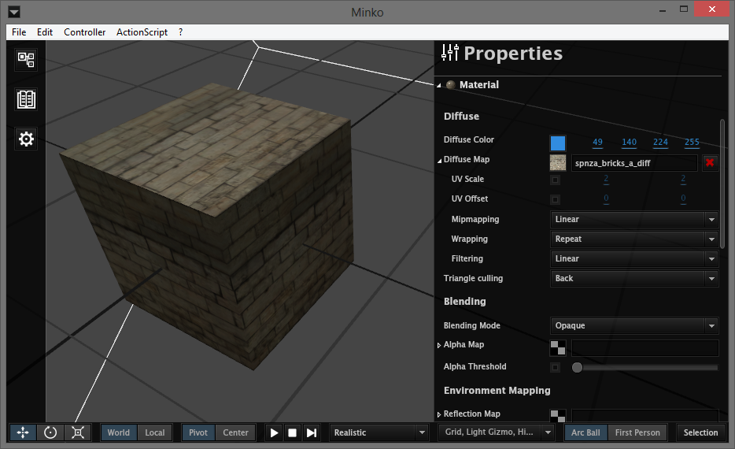

-   `UV Scale`: this will affect how your texture is mapped to the mesh. The UVs will be scaled, in order to stretch the texture and make it look bigger or smaller.
-   `UV Offset`: just like the UV Scale, this will affect the mapping of your texture. The UVs will be offseted, in order to move the texture position on the mesh.
-   `Mipmapping`: changes how mimpaps will be used. `None` disables mipmapping, `Nearest` enables mipmapping with nearest-neighbor interpolation between mipmap levels and `Linear` enables mipmapping with linear interpolation between mipmap levels.
-   `Wrapping`: wether or not the texture will repeat itself.
-   `Filtering`: chooses between nearest neighbor interpolation or linear interpolation for displaying the texture.

#### Triangle Culling

Changes which side of triangles are not visible:

-   `Back`: default value, does not render the back side of triangles.
-   `Both`: will not render any side of the triangles (the meshes will appear invisible).
-   `Front`: will not render the front side of triangles.
-   `None`: will render both sides of the triangles.

Blending
--------

#### Blending Mode

-   `Opaque`: default mode, will render the meshes opaque. Alpha values will have no effect.
-   `Additive`: the material color will be added to the color visible behind it. Alpha values will have no effect.
-   `Alpha`: the material color will be blended with the color visible behind it, accordingly with the alpha values. The higher the alpha is, the more opaque the material will be.
-   `Multiply`: the material color will be multiplied by the color behind it.

#### Alpha Map

This map will be used to define the alpha values on the material. `Blending Mode` must be set to `Alpha` for these values to be used.

-   Alpha Map in opaque blending mode :

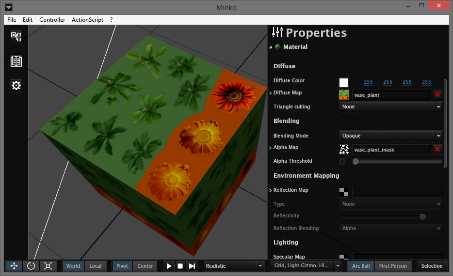

-   Alpha Map in alpha blending mode :

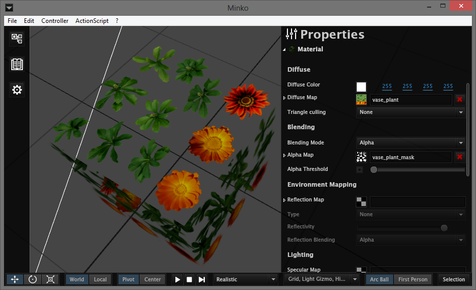

#### Alpha Threshold

Any part of the material with an alpha value inferior to the `Alpha Threshold` value will not be displayed.

Environment Mapping
-------------------

#### Reflection Map

Drag and drop a texture from the `Assets` panel to use as a reflection map. The environement map will be used to simulate reflections at the surface of a mesh.

#### Type

Minko supports two types of reflection maps :

-   `Blinn Newell`
-   `Probe`

#### Reflectivity

Will change the level of reflection blending. 1 is the highest value and will override the material color.

-   Reflectivity = 1

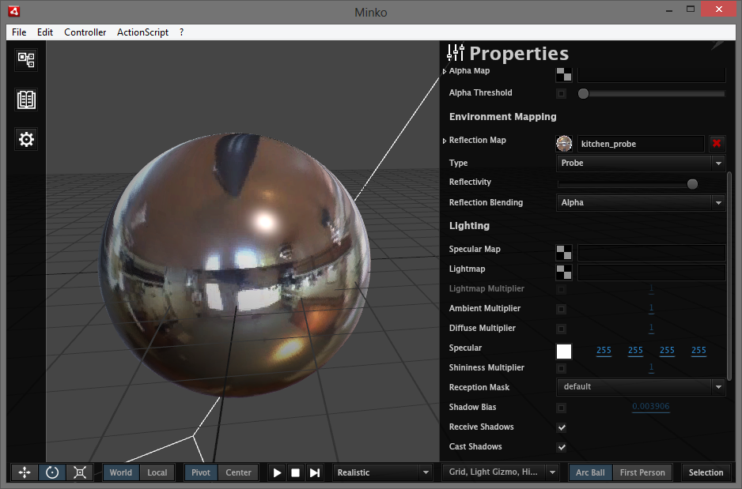

-   Reflectivity = 0.5

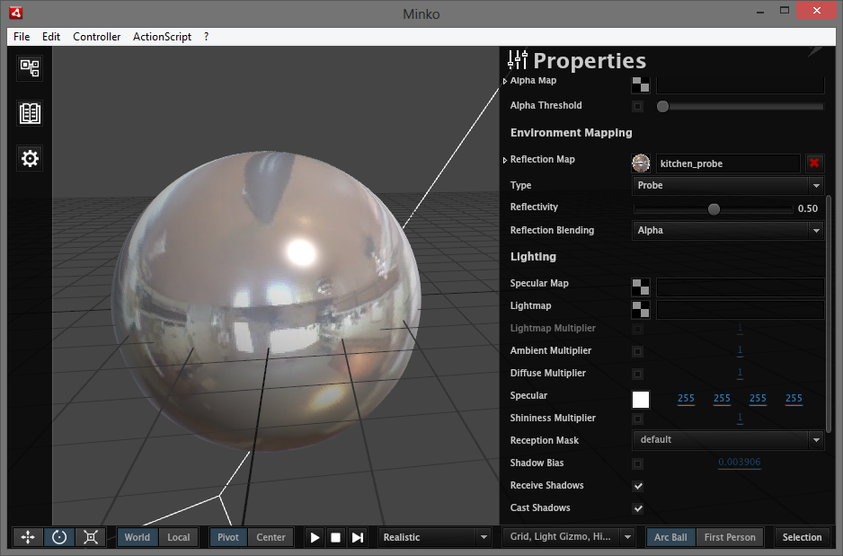

-   Reflectivity = 0.1

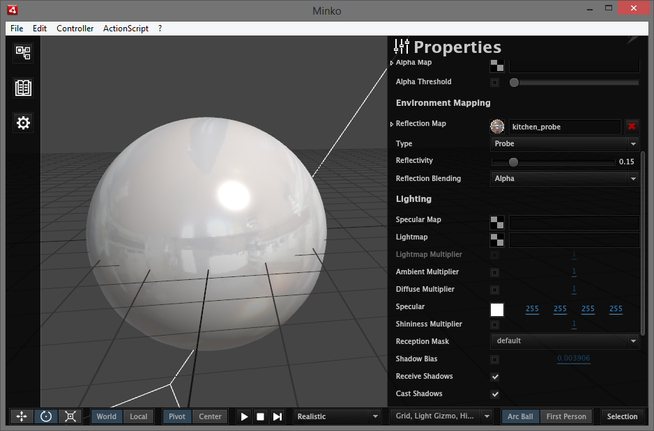

#### Reflection Blending

How the reflection is blended with the material color.

-   `Opaque`: the reflection color will replace entirely the material color. `Reflectivity` will have no effect.
-   `Additive`: the reflection color and the material color will be added. `Reflectivity` will have no effect.
-   `Alpha`: the reflection color will be blended with the material color, accordingly to the `reflectivity` value.
-   `Alpha Multiply`: the reflection color and the material color will be multiplied accordingly to the `reflectivity` value.

Lighting
--------

#### Specular Map

Drag and drop a texture from the `Assets` panel to use as specular map. The specular map will be used to affect how the material looks under a light specular.

Without a specular map, the light specular will only appear as a round spot, overriding the material color. A specular map will change what how the material looks under the specular :

-   Without specular map

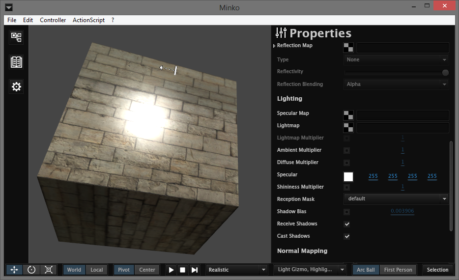

-   With a specular map

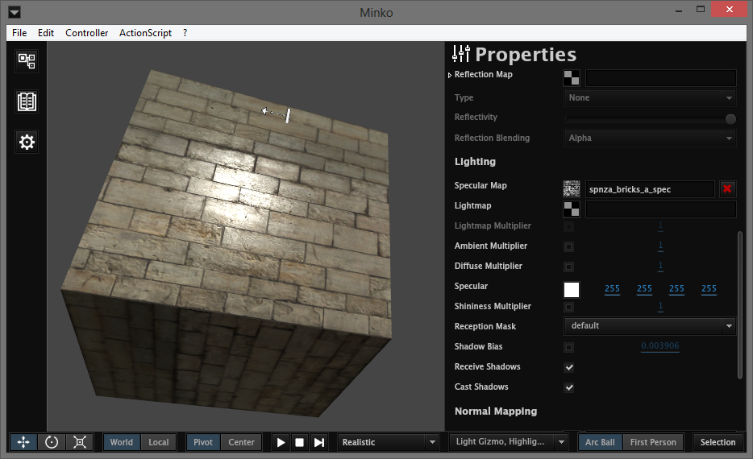

#### Lightmap

#### Ambient Multiplier

Will multiply the scene ambient lights effect on the material.

#### Diffuse Multiplier

Will multiply the scene lights diffuse values for this material.

#### Specular

The specular color will be added to the color of the specular generated by each light.

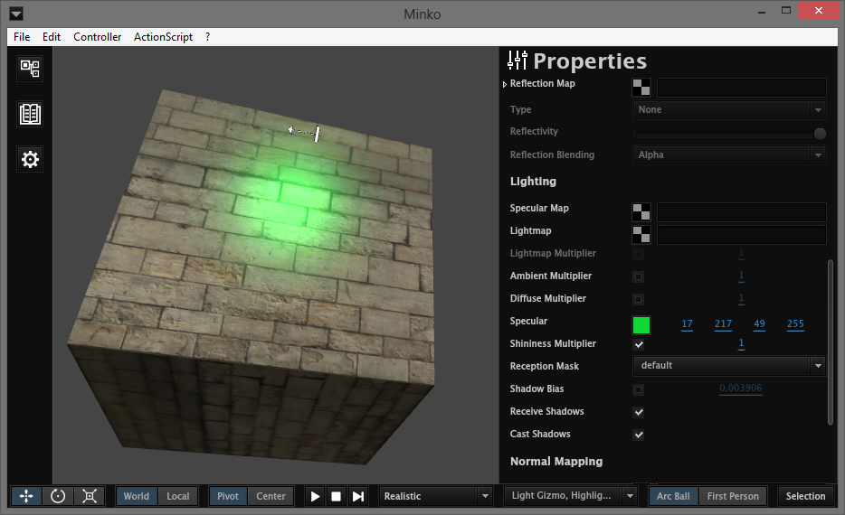

#### Shininess Multiplier

Multiplies the shininess values of scene lights for this material. The lower the value, the bigger the specular dot will be.

-   Shininess Multiplier = 0.3

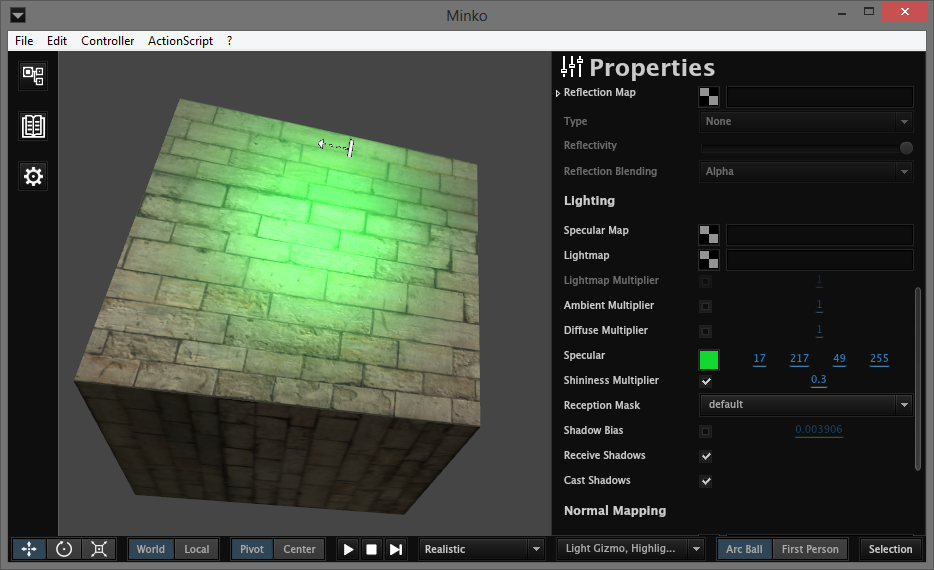

-   Shininess Multiplier = 10

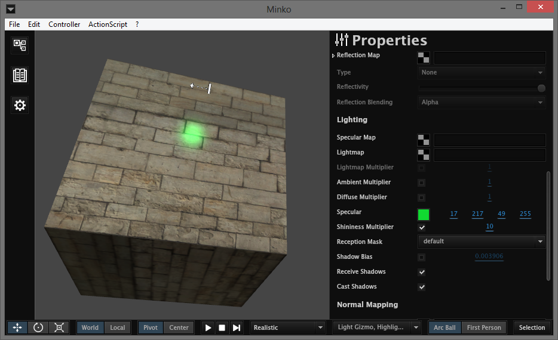

#### Reception Mask

Selects which lights will affect the material. If you add a `layer` to the `reception mask` of a material, every light that has this `layer` in its `emission mask` will affect the material.

#### Cast/Receive Shadows

If `cast shadows` is checked, the meshes using this material will cast shadows on meshes using a material that has `Receive shadows` checked and that is within the same `reception mask`.

Normal Mapping
--------------

#### Normal Map

Drag and drop a texture from the `Assets` panel to use as a `normal map`. The `normal map` will be used to give a relief effect to an otherwise flat surface.

-   No normal map

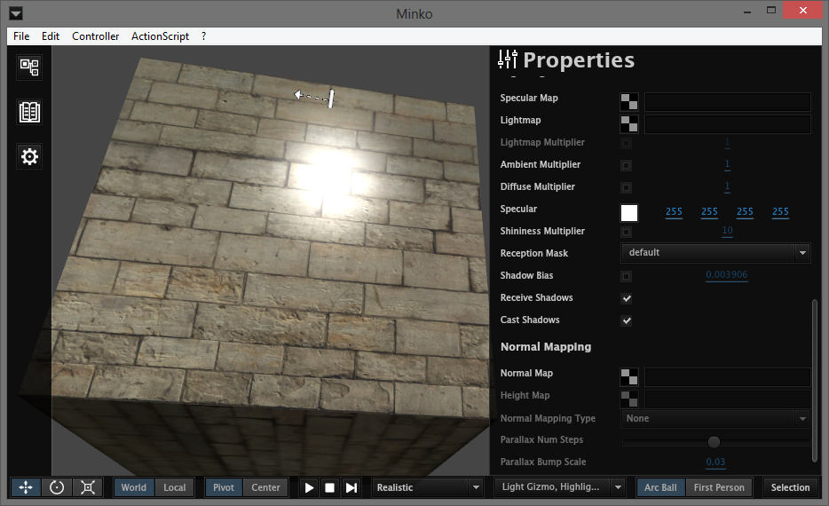

-   Normal map

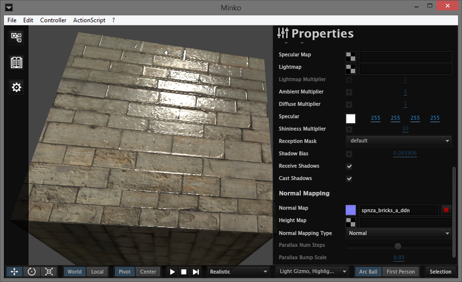

#### Height map

Drag and drop a texture from the `Assets` panel to use as an `height map`. The `height map` will be used for `parallax` mapping, which will give an extra effect of relief to the surface.

Since `height map` and `normal map` are used together, you must set a `normal map` before setting an `height map`.

#### Normal Mapping Type

You can choose between two `normal mapping types`:

-   `None`: disables normal mapping. Selected by default when neither `normal map` nor `height map` are set.
-   `Normal`: the `normal map` will be used for normal mapping.
-   `Parallax`: the `normal map` and `height map` will be used for normal mapping. This can only be enabled if both `normal map` and `height map` are set.

<!-- -->

-   Normal mapping type = None

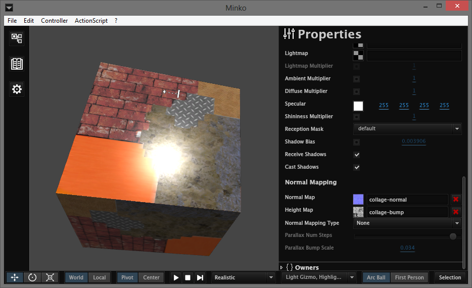

-   Normal mapping type = Normal

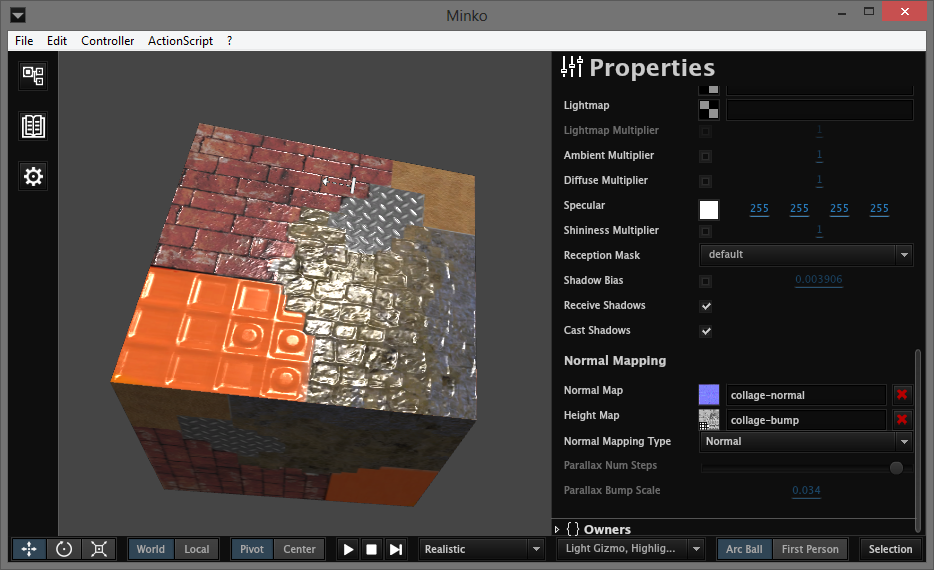

-   Normal mapping type = Parallax

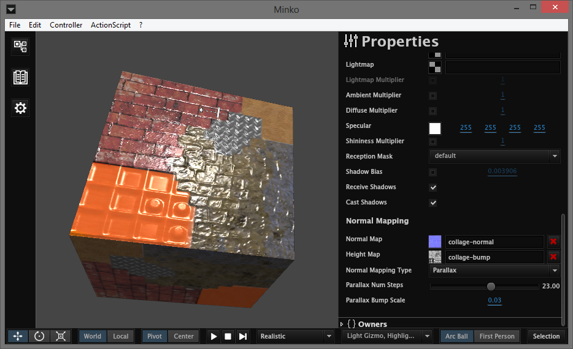

#### Parallax Bump Scale

This parameter is enabled only when the `normal mapping type` is set to `parallax`. This will increase or decrease the depth effect of the `parallax` mapping. The lower the value, the lower the depth effect.

-   Parallax bump scale = 0.01

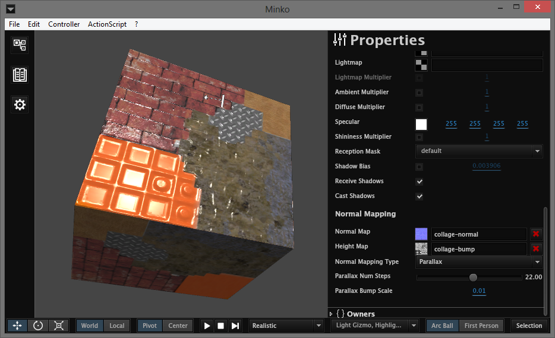

-   Parallax bump scale = 0.05

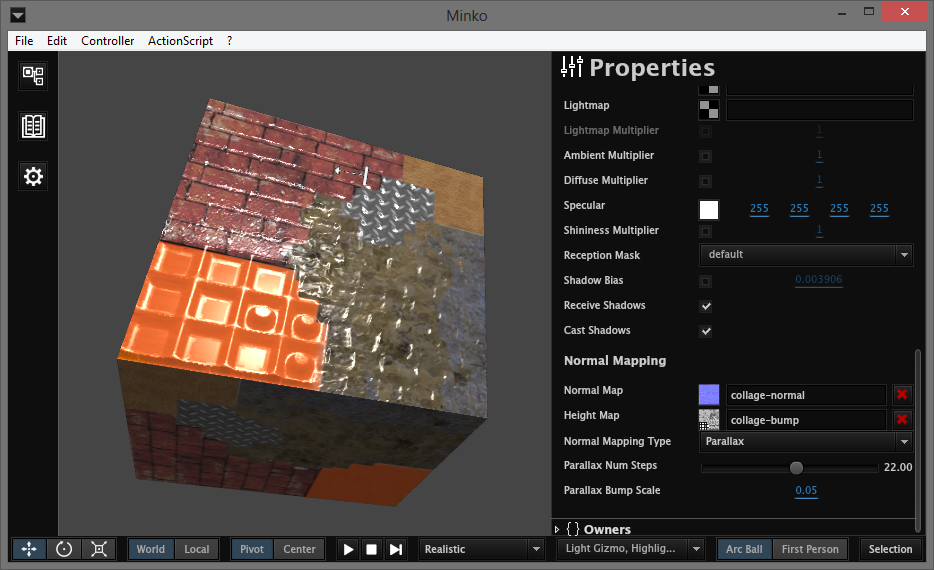

-   Parallax bump scale = 0.08

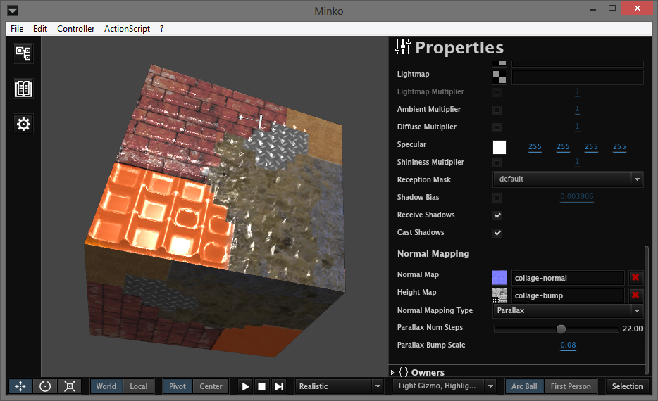

