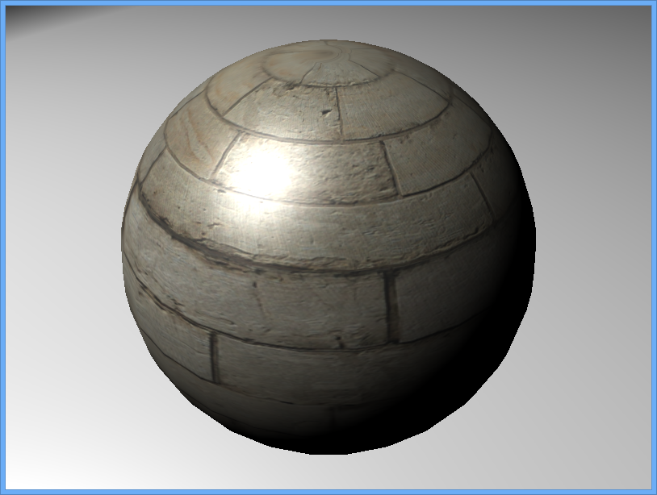

test
====

  <h1>Hi there!</h1> Welcome to the official **Minko 3** documentation. Here you will find all the resources you might need to start working with Minko and learn everything about it. Tutorials, examples, technical articles... we've gathered everything in one place to make your work easier. Enjoy :)

[Let's get started!](Getting started with Minko 3 beta 1) 

Minko is a **free** and **open source** real-time **3D** framework created by [Aerys](http://aerys.in). Minko is designed to create fast and robust 3D applications for **the web, desktop and mobile devices**. It is currently compatible with the following platforms:

-   OSX, Linux and Windows computers
-   Any HTML5/WebGL capable web browser
-   Android smartphones and tablets
-   iPhone 3GS, iPhone 4, iPhone 4S, iPhone 5, iPad, iPad 2, iPad 3 and iPad 4

You can find the complete list and the status for each platform on our [Platform compatibility matrix](article/Platform_compatibility_matrix.md).

Make sure you check the following pages to get started:

-   [Developer reference](http://doc.v3.minko.io/reference/)
-   [Tutorials](tutorial/Tutorials.md)
-   [Examples](Examples.md)
-   [Articles](Articles)

If you are looking for professional technical support, please [contact us](http://minko.io/contact)!

You can find Minko 2 documentation [here](http://doc.v2.minko.io/wiki/Main_Page).

