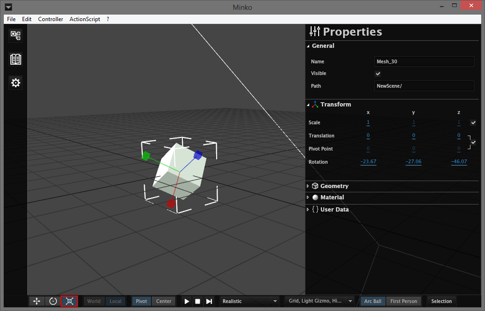

Transform gizmos
================

With the three left buttons, you can switch between the transform gizmos. These gizmos give you a way to move elements from the scene in a more visual way. The modes are, from left to right :

-   Translation

-   Rotation

-   Scale

Next is the spacial reference for the gizmos. You can move them in local space or world space 

Finally, you can choose the point used as pivot point for the rotations. center uses the center of the geometric center of the mesh/group, and pivot uses either the origin of the mesh/group, or the pivot point if you provided one. 

For more details on transform manipulation, see the [Manipulating transforms](Manipulating_transforms.md) tutorial.

Animations and physics control
==============================

The next buttons are used to control the animations and the physics world.

Play/Pause button
-----------------

The play button will start the animations, and will start the physics world. When playing, it is replaced by a pause button that will pause the animations and physics simulation.

Stop Button
-----------

This button will stop the animations and reset them to their first frame. It will also stop the physics simulation and reset any physics element to its initial place.

Step button
-----------

This button will step one frame into the animations. It has no effect on the physics world.

Rendering mode
==============

The drop-down list in the middle of the bar allows you to choose between different render modes.

Basic
-----

This mode will render everything with a basic effect, not taking any light into account. 

Realistic
---------

This mode will render everything with a phong effect. All lights phong related properties will be taken into account. Note that without any light on your scene, everything will be rendered black.

Greybox
-------

This mode will render everything in different levels of grey.

UVs
---

This mode will show how UVs are mapped on each mesh. This is useful for debugging texture mapping problems. 

Normals
-------

This mode will show the normals on each mesh.

Visual elements checklist
=========================

This checklist allows you to enable and to disable visual elements on the scene :

-   Grid (the grid on the XZ plan)
-   Light gizmos
-   Highlight (highlighting effect on a selected node)
-   Colliders (visual representation of physics colliders, displayed in wireframe)
-   Selection box (around the bounding box of a selected node)
-   Frustums (a visual representation of the camera and light frustums)
-   Skeleton (a visualisation of animation skeletons)
-   Joints (visual representation of physics joints)

Camera type
===========

This button allows you to switch between the Arc Ball camera (rotating around the selected node) and the First Person camera (moving freely in the scene).

For more details on moving the camera in the scene, see the [Moving the camera in the scene](Moving_the_camera_in_the_scene.md) tutorial.

Multi-selection
===============

The last button allows you to enable and disable multi-selection. When enabled, you can select multiple nodes on the scene by just clicking and dragging your mouse over the nodes you want to select.

