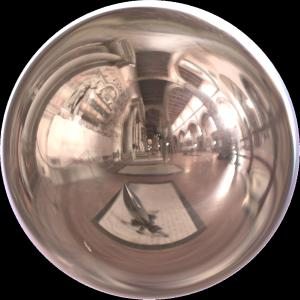
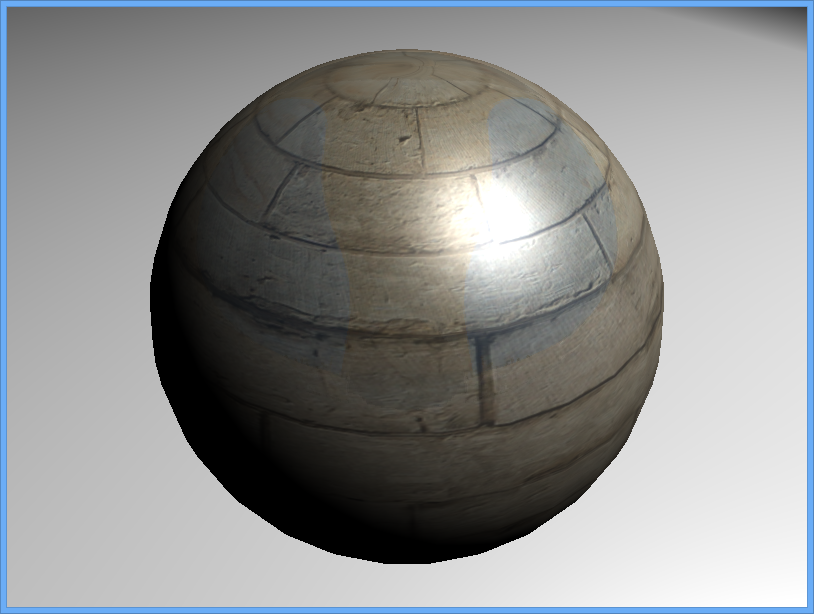

This tutorial will introduce environment map and how to use it in your scene.

What is a environment map
-------------------------

Environment maps are textures that Minko uses to simulate reflection on a 3D object. The texture stores the image of an environment surrounding the rendered objects. There is three types of environment map corresponding to three methods in the shader to render an environment map:

-   2D Texture for Blinn Newell technique
-   2D Texture for Probe technique
-   Cube Texture

| Blinn Newell                                                               | Probe                                                                      | Cube Texture                                                                                         |
|----------------------------------------------------------------------------|----------------------------------------------------------------------------|------------------------------------------------------------------------------------------------------|
|  |  |  |

Prerequisites
-------------

To fully understand the rest of the tutorial, you need to know how to setup a scene with a phong material, and how to load textures:

-   [Working with the PhongMaterial](../tutorial/11-Working_with_the_PhongMaterial.md)
-   [Loading and using textures](../tutorial/15-Loading_and_using_textures.md)

Step 0: Setup a scene
---------------------

The setup will be the same that the one at the end of the [Working with the PhongMaterial](../tutorial/11-Working_with_the_PhongMaterial.md) tutorial:

```cpp
#include "minko/Minko.hpp" 
#include "minko/MinkoPNG.hpp" 
#include "minko/MinkoSDL.hpp"

using namespace minko; 
using namespace minko::component; 
using namespace minko::math;

int main(int argc, char** argv) {

   auto canvas = Canvas::create("", 800, 600);
   auto sceneManager = SceneManager::create(canvas->context());
   // add the png parser to load textures
   // add the Phong effect
   sceneManager->assets()
       ->registerParser<[file::PNGParser>](file::PNGParser>)("png")
       ->queue("texture/diffuseMap.png")
   ->queue("effect/Phong.effect");
   auto _ = sceneManager->assets()->complete()->connect([=](file::AssetLibrary::Ptr assets)
   {
   auto root = scene::Node::create("root")
       ->addComponent(sceneManager);
       auto phongMaterial = material::PhongMaterial::create();
       phongMaterial->diffuseColor(0xFFFFFFFF);
       phongMaterial->diffuseMap(assets->texture("texture/diffuseMap.png"));
       phongMaterial->shininess(2.f);
       phongMaterial->specularColor(math::Vector4::create(0.4f, 0.8f, 1.f, 1.f));
   auto mesh = scene::Node::create("mesh")
       ->addComponent(Transform::create(Matrix4x4::create()->prependScale(1.1)))
       ->addComponent(Surface::create(
           geometry::SphereGeometry::create(sceneManager->assets()->context()),
           phongMaterial,
           assets->effect("effect/Phong.effect")
       ));
   auto camera = scene::Node::create("camera")
           ->addComponent(Renderer::create(0x00000000))
       ->addComponent(Transform::create(Matrix4x4::create()->lookAt(Vector3::create(), Vector3::create(0.0f, 2.f, 2.6f))
           ))
       ->addComponent(PerspectiveCamera::create(800.f / 600.f, (float)PI * 0.25f, .1f, 1000.f));
   auto spotLight = scene::Node::create("SpotLight")
       ->addComponent(SpotLight::create(0.6f, 0.78f, 20.f))
       ->addComponent(Transform::create(Matrix4x4::create()->lookAt(Vector3::zero(), Vector3::create(3.f, 5.f, 1.5f))));
   spotLight->component<SpotLight>()->diffuse(0.5f);
   auto ambientLight = scene::Node::create("ambientLight")
       ->addComponent(AmbientLight::create(0.2f));
   ambientLight->component<AmbientLight>()->color(Vector4::create(1.0f, 1.0f, 1.0f, 1.0f));
   root->addChild(ambientLight);
   root->addChild(camera);
       root->addChild(mesh);
   root->addChild(spotLight);
   auto enterFrame = canvas->enterFrame()->connect([&](Canvas::Ptr canvas, float t, float dt)
   {
       sceneManager->nextFrame(t, dt);
   });
   canvas->run();
   });
   sceneManager->assets()->load();
   return 0;

} 
```


Step 1: Setting a environment map
---------------------------------

Environment map are images just like diffuse maps, so their loading workflow are identical: 
```cpp
sceneManager->assets()->queue("texture/envmap.png"); 
```


To modulate the `environmentMap` another property of the `PhongMaterial` indicates the percentage of environment map that should be mixed with the computed color: EnvironmentAlpha.

-   `PhongMaterial::environmentMap(AbstractTexture::Ptr texture, render::EnvironmentMap2dType type)`
-   `PhongMaterial::environmentAlpha(float alpha)` alpha must be between 0 and 1

The type of environment mapping must be set at the same time as the texture except for the cube maps (the type is set automatically).

```cpp
phongMaterial->environmentMap(assets->texture("texture/envmap.png"), render::EnvironmentMap2dType::BlinnNewell);

// or

phongMaterial->environmentMap(assets->texture("texture/envmap.png"), render::EnvironmentMap2dType::PROBE);

// or

phongMaterial->environmentMap(assets->texture("texture/cubeMap.png"))

// 20% of environment for 80% of computed color

phongMaterial->environmentAlpha(0.2f); 
```


| Environment Alpha                                                          | 0.2                                                            | 0.5                                                            | 0.95                                                           |
|----------------------------------------------------------------------------|----------------------------------------------------------------|----------------------------------------------------------------|----------------------------------------------------------------|
|  |  |  |  |

Final Code
----------

```cpp
#include "minko/Minko.hpp" 
#include "minko/MinkoPNG.hpp" 
#include "minko/MinkoSDL.hpp"

using namespace minko; 
using namespace minko::component; 
using namespace minko::math;

int main(int argc, char** argv) {

   auto canvas = Canvas::create("Minko Tutorial - Working with environment maps", 800, 600);
   auto sceneManager = SceneManager::create(canvas->context());
   // add the png parser to load textures
   // add the Phong effect
   sceneManager->assets()
       ->registerParser<[file::PNGParser>](file::PNGParser>)("png")
       ->queue("texture/diffuseMap.png")
       ->queue("texture/envmap.png")
   ->queue("effect/Phong.effect");
   auto _ = sceneManager->assets()->complete()->connect([=](file::AssetLibrary::Ptr assets)
   {
   auto root = scene::Node::create("root")
       ->addComponent(sceneManager);
       auto phongMaterial = material::PhongMaterial::create();
       phongMaterial->diffuseColor(0xFFFFFFFF);
       phongMaterial->diffuseMap(assets->texture("texture/diffuseMap.png"));
       phongMaterial->environmentMap(assets->texture("texture/envmap.png"), render::EnvironmentMap2dType::BlinnNewell);
       phongMaterial->environmentAlpha(0.2f);
   auto mesh = scene::Node::create("mesh")
       ->addComponent(Transform::create(Matrix4x4::create()->prependScale(1.1)))
       ->addComponent(Surface::create(
           geometry::SphereGeometry::create(sceneManager->assets()->context()),
           phongMaterial,
           assets->effect("effect/Phong.effect")
       ));
   auto camera = scene::Node::create("camera")
           ->addComponent(Renderer::create(0x00000000))
       ->addComponent(Transform::create(Matrix4x4::create()->lookAt(Vector3::create(), Vector3::create(0.0f, 2.f, 2.6f))
           ))
       ->addComponent(PerspectiveCamera::create(800.f / 600.f, (float)PI * 0.25f, .1f, 1000.f));
   auto spotLight = scene::Node::create("SpotLight")
       ->addComponent(SpotLight::create(0.6f, 0.78f, 20.f))
       ->addComponent(Transform::create(Matrix4x4::create()->lookAt(Vector3::zero(), Vector3::create(3.f, 5.f, 1.5f))));
   spotLight->component<SpotLight>()->diffuse(0.5f);
   auto ambientLight = scene::Node::create("ambientLight")
       ->addComponent(AmbientLight::create(0.2f));
   ambientLight->component<AmbientLight>()->color(Vector4::create(1.0f, 1.0f, 1.0f, 1.0f));
   root->addChild(ambientLight);
   root->addChild(camera);
       root->addChild(mesh);
   root->addChild(spotLight);
   auto enterFrame = canvas->enterFrame()->connect([&](Canvas::Ptr canvas, float t, float dt)
   {
       sceneManager->nextFrame(t, dt);
   });
   canvas->run();
   });
   sceneManager->assets()->load();
   return 0;

} 
```


Where to go from here
---------------------

`environmentMap` can me mixed with `specularMap` ([Working with specular maps](../tutorial/14-Working_with_specular_maps.md)) and/or `normalMap` ([Working with normal maps ](../tutorial/12-Working_with_normal_maps.md)) to produce great effect on your 3D models: [ PhongMaterial reference full example](../tutorial/PhongMaterial_reference#Full_Example.md).

