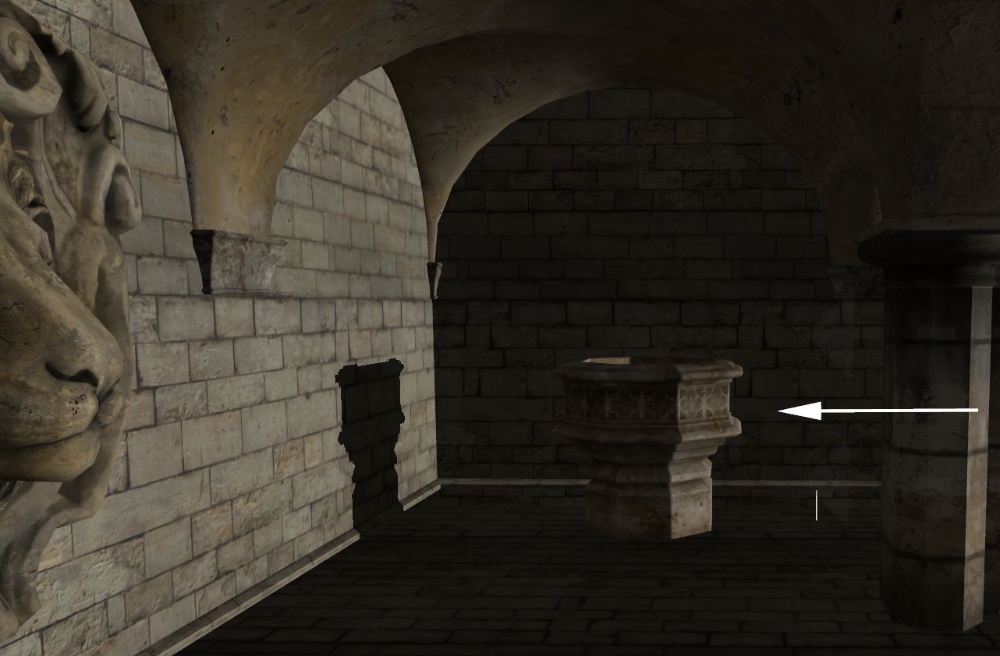

Unlike [point lights](../tutorial/27-Working_with_point_lights.md), which occupy a specific location in the 3D scene, a directional light doesn't have a position, ONLY a direction. Rays of from directional lights run parallel in a single direction from every point in the sky, and are typically used to simulate direct light.

Because a directional light represents a distant light source, its x,y,z coordinate means nothing—only its rotational attribute has any bearing on how the scene will be illuminated.


Directional light emitting from the left to the right



As you can see in this more complex example, the directional light comes from a direction, not a specific location. it's particularly visible on the column shadow.

Step 1: Instantiate a directional light
---------------------------------------

The first very first thing you need to do is to include the following header to your .cpp file.

```cpp
#include <DirectionalLight.hpp> 
```


To create a new [DirectionalLight](http://doc.v3.minko.io/reference/classminko_1_1component_1_1_directional_light.html) object, we simply use the `DirectionalLight::create` static method.

Step 2: Adding a directional light to the scene
-----------------------------------------------

To add a point light to a scene, you have to understand that a `Scene` is a graph composed of one or more `Node`. Those nodes can contain elements that are called `Component`.

As `DirectionalLight` is a `Component` you'll have to follow this logic to create and add a light to a scene.

```cpp


 // Creating the Node
 auto directionalLightNode = scene::Node::create("directionalLight");
       
 // Adding the Component DirectionalLight
 directionalLightNode->addComponent(DirectionalLight::create());

  // Adding the Node to the root of the scene graph
 root->addChild(directionalLightNode);

```


As you can see in the code above, we first create a node named "directionalLight" to which we add an instance of a directional light. Of course you can chain those methods to perform all in one line of code

```cpp


 // Creating the Node & adding the Component DirectionalLight
 auto directionalLightNode = scene::Node::create("directionalLight")->addComponent(DirectionalLight::create());

```


Step 3: Change directional light properties
-------------------------------------------

you can directly change way the light appears by modifying it's public parameters, for example : 
```cpp


 auto directionalLight = DirectionalLight::create();
 directionalLight->diffuse(.4f);
 directionalLight->color()->setTo(0,0,0);

```


Step 4: Adjust a directional light
----------------------------------

Once the light is created you might want to give a direction to your directional light. To do this you need to add a transformation matrix to the Node holding your light.

```cpp
auto directionalLightNode= scene::Node::create("directionalLight")

       ->addComponent(DirectionalLight::create())
       ->addComponent(Transform::create(Matrix4x4::create()->lookAt(Vector3::zero(), Vector3::create(15.f, 20.f, 0.f))));

```


Step 5: Remove a directional light from the scene
-------------------------------------------------

You may sometime need to remove a light from a scene, to do this you simply need to remove the directional light from the `Node` it has been added to before.

```cpp


 // Adding an directional light
 auto directionalLightNode = scene::Node::create("directionalLight")->addComponent(DirectionalLight::create());

 // retrieving the component 
 auto directionalLight = directionalLightNode->component<DirectionalLight>(0);

 // Remove the component from the node
 directionalLightNode->removeComponent(directionalLight);

```


As you can see above, the first step is to retrieve the light component with previously created and then remove it from the `Node`

Final Code
----------

```cpp
#include "minko/Minko.hpp" 
#include "minko/MinkoSDL.hpp"

using namespace minko; 
using namespace minko::math; 
using namespace minko::component;

const uint WINDOW_WIDTH = 800; 
const uint WINDOW_HEIGHT = 600;

int main(int argc, char** argv) {

 auto canvas = Canvas::create("Minko Tutorial - Working with directional lights", WINDOW_WIDTH, WINDOW_HEIGHT);
 auto sceneManager = component::SceneManager::create(canvas->context());
 sceneManager->assets()
     ->queue("effect/Phong.effect");
 
 auto complete = sceneManager->assets()->complete()->connect([&](file::AssetLibrary::Ptr assets)
 {
   auto root = scene::Node::create("root")
     ->addComponent(sceneManager);
   auto camera = scene::Node::create("camera")
       ->addComponent(Renderer::create(0x7f7f7fff))
       ->addComponent(PerspectiveCamera::create(
           (float)WINDOW_WIDTH / (float)WINDOW_HEIGHT, (float)PI * 0.25f, .1f, 1000.f));
   root->addChild(camera);
   auto phongMaterial = material::PhongMaterial::create();

   phongMaterial->diffuseColor(0xFF0000FF);
   phongMaterial->specularColor(0xFFFFFFFF);
   phongMaterial->shininess(16.0f);

   auto sphere = scene::Node::create("sphere")
     ->addComponent(Transform::create(Matrix4x4::create()->translation(0.f, 0.f, -5.f)))
     ->addComponent(Surface::create(
       geometry::SphereGeometry::create(assets->context()),
       phongMaterial,
       assets->effect("effect/Phong.effect")
     ));
   sphere->component<Transform>()->matrix()->prependRotationY(PI * 0.25f);
   root->addChild(sphere);

   auto ambientLight = scene::Node::create("ambientLight")
       ->addComponent(AmbientLight::create(0.25f));
   ambientLight->component<AmbientLight>()->color(Vector4::create(1.0f, 1.0f, 1.0f, 1.0f));
   root->addChild(ambientLight);

   auto directionalLight = scene::Node::create("directionalLight")
       ->addComponent(DirectionalLight::create()->diffuse(0.8f)->color(0xFFFFFFFF))
       ->addComponent(Transform::create(Matrix4x4::create()->lookAt(Vector3::create(), Vector3::create(5.0f, 0.0f, 0.0f))));
   root->addChild(directionalLight);

   auto enterFrame = canvas->enterFrame()->connect([&](Canvas::Ptr canvas, float t, float dt)
   {
       sceneManager->nextFrame(t, dt);
   });

   canvas->run();
 });
 sceneManager->assets()->load();
 return 0;

} 
```


