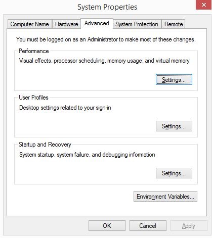

Step 1: Downloading and extracting the SDK
------------------------------------------

**During the beta the SDK is only installable from the sources and this step does not work. Please folow the [Getting started with Minko 3 beta 1](../tutorial/Getting_started_with_Minko_3.md) tutorial.**

<strike>The first step is to download the Minko SDK and extract it wherever you want on your local machine. The archive download is available here:

-   [Download the latest stable Minko SDK](http://minko.io/engine/#download)
-   [Download the latest development Minko SDK](http://minko.io/engine/#download)

If you are looking for a production ready SDK, please use the "stable" release. Otherwise if you are looking for the latest features please use the "development" release. When the download is finished, open the archive and extract it wherever you want. Make sure you remember this location though as it will be used in step 2.</strike>

Step 2: Setup your environment
------------------------------

You have to set an environment variable that will be used by Minko's build system to locate the SDK you just installed. You just have to set the `MINKO_HOME` environment variable to the actual path of the SDK. This is the path to the root of the SDK as you get if from the ZIP archive (or the GIT repository) and where you can actually find a file called `sdk.lua`.

### Windows

Go to Control Panel-> System-> Advanced system settings and click on "Environment Variables"



Then click on "New..." in the "System variables" panel (or in the "User variables" panel if you want to setup the SDK for your own user only)


The "New System Variable" window will open, enter the following settings:

-   Variable name : MINKO_HOME
-   Variable value : the path to the actual Minko SDK root folder on your file system (ex: "C:\minko-sdk" without quotes)

and press "OK". If it worked correctly the `MINKO_HOME` environment variable should now be in the list.

### Linux / OS X

Open a terminal and type or copy/paste the following command line

```bash
export MINKO_HOME=/path/to/the/minko/sdk 
```


This will **temporarily** set the `MINKO_HOME` environment variable. **To make sure this change permanent, add it to your shell .rc file** (ex: `~/.bashrc` if you are using bash). To do this, type or copy/paste the following command line in the terminal:

```bash
echo "export MINKO_HOME=/path/to/the/minko/sdk"->> ~/.bashrc 
```


Of course, you have to adapt this command line using the actual path of the Minko SDK on your system and the right target .rc file for your shell.

Step 3: Installing toolsets
---------------------------

Now that's you've got the SDK set up, let's use Minko. Depending on host and target platforms, you have multiple choices to build a Minko application. Here's a collection of tutorials you might want to read:

-   [Targeting Windows](../tutorial/Targeting_Windows.md)
-   [Targeting OS X](../tutorial/Targeting_OS_X.md)
-   [Targeting Linux](../tutorial/Targeting_Linux.md)
-   [Targeting iOS](../tutorial/Targeting_iOS.md)
-   Targeting Android
-   [Targeting HTML5](../tutorial/Targeting_HTML5.md)
-   Targeting Flash (coming when Adobe [updates its compiler](https://github.com/adobe-flash/crossbridge/issues/28)...)

